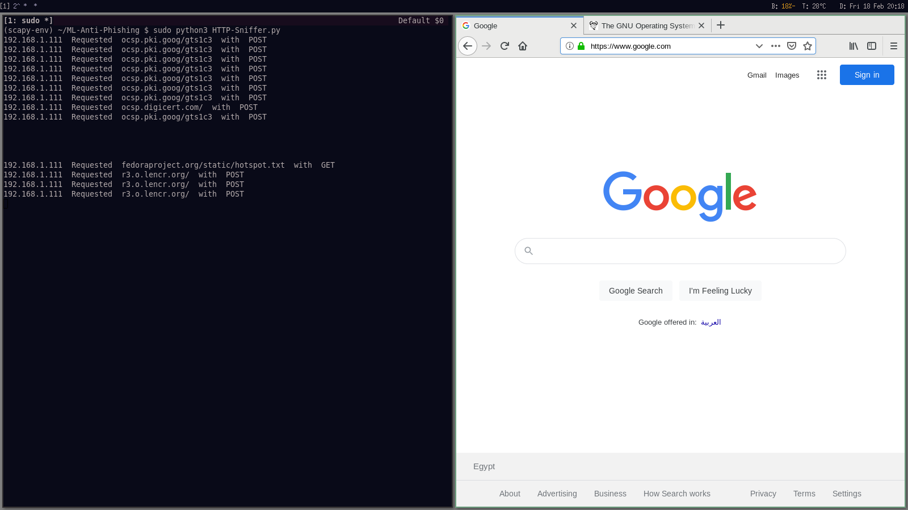
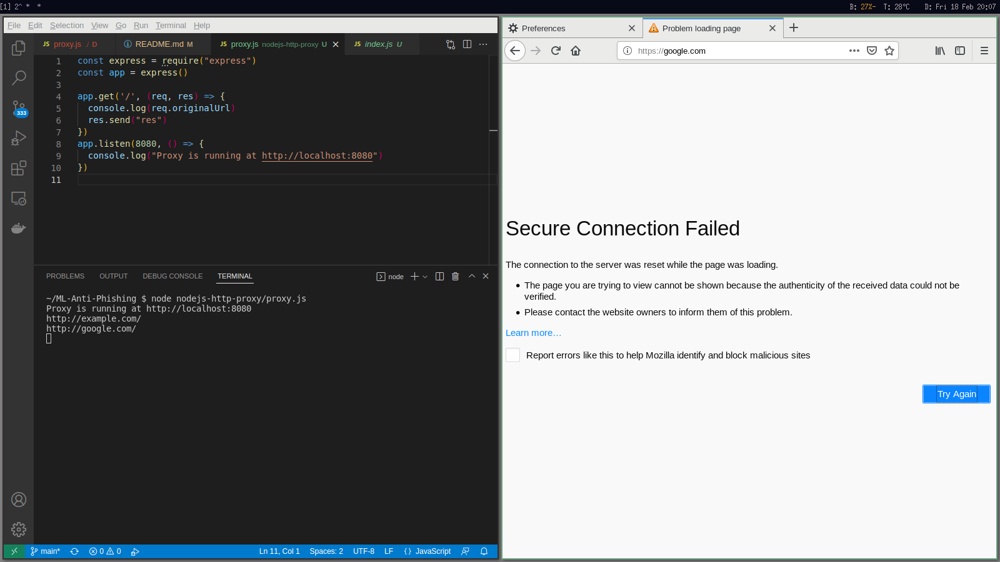

# ML-Anti-Phishing
Machine Learning Model for Anti-Phishing

### Tries

#### 1. Using [Scapy](https://scapy.net)
Scapy: is a Python Library for Packet-Manipulation/Traffic-Sniffing

- [Script to sniffing all HTTP Packets](./HTTP-Sniffer.py) : Sniffing all packets from WLAN0 Network Interface Card(NIC) and filtering HTTP packets only.


###### Steps
```bash
$ pip install venv
$ python3 -m venv scapy-env
$ source scapy-env/bin/activate
$ pip install scapy
$ python3 ./scapy.py
```

#### 2. Creating HTTP Proxy Server with [ExpressJS](http://expressjs.com) over [NodeJS](https://nodejs.org/en)

- [Source Code](./nodejs-http-proxy/proxy.js)

###### Steps
1. install NodeJS

```bash
$ cd nodejs-http-proxy/
$ npm init -y
$ npm install express
$ node proxy.js
```
#### 3. Using [Squid Proxy](http://www.squid-cache.org)

#### 4. Using [MITM Proxy](https://mitmproxy.org)

#### 5. Using [DNSmsq](http://www.thekelleys.org.uk/dnsmasq/doc.html)
- Working on DNS Level
-- Issues: Intensive data for all types of

#### 6. Using [Privoxy](https://www.privoxy.org)
- Working on DNS Level
-- Issues: Intensive data for all types of


#### 7. Using Headless Web Browsers Like [Puppeteer.js](https://pptr.dev) [PlayWright](https://playwright.dev)
- Working on DNS Level
-- Issues: Intensive data for all types of


#### 8. Using Automation Frameworks/Tools like [Selenium](https://www.selenium.dev)
- Working on DNS Level
-- Issues: Intensive data for all types of


### Sammary and Recommended Solution:
=> Direct Communication with Web Browser APIs to Extract Domain name of every URL by making Web Browser Extension/Plugin.

